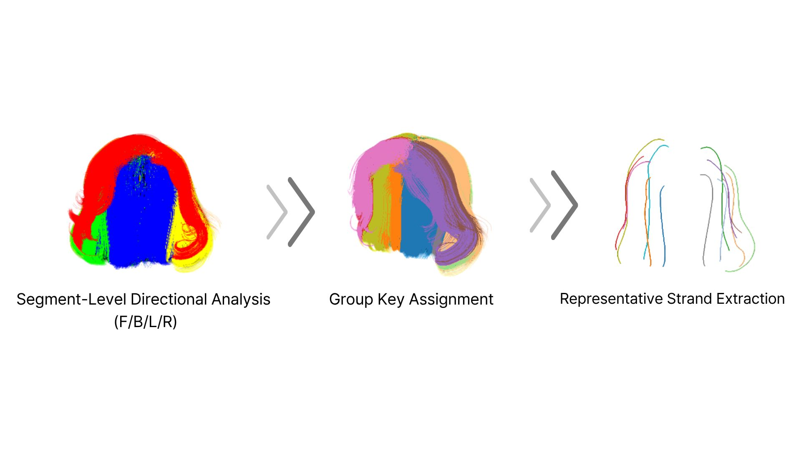
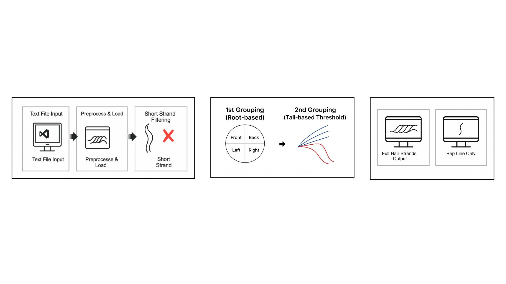

# HairReduct
Hair strand clustering and simplification framework

HairReduct is a novel simplification framework that efficiently groups and reduces hair strands by leveraging position, direction, and curvature information. It dramatically decreases data size while preserving the flow and structural consistency of hair, enabling more efficient processing for graphics applications. With intuitive visualization and adjustable parameters, HairReduct offers a flexible solution for various hair graphics pipelines including simulation, rendering, and animation.

